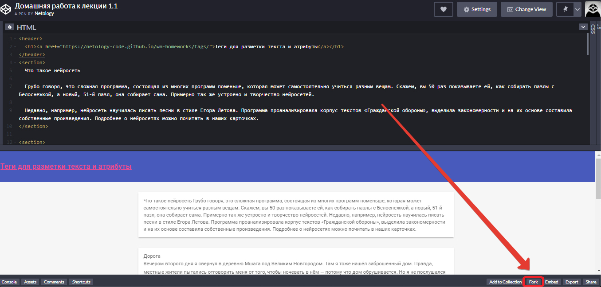

# Инструкция по работе с онлайн-редактором Codepen

1. Перейдите по ссылке на [codepen.io](https://codepen.io).
2. На открывшейся странице перейдите в форму регистрации, нажав кнопку **Sign Up for Free**.

Вы можете зарегистрироваться используя аккаунты в Facebook, Twitter или Github. Либо, вы можете создать аккаунт без привязки к социальным сетям.

3. На следующей странице можете заполнить личные данные. Это не обязательно, на ваше усмотрение. Нажмите кнопку **Save & Continue**.

4. Подтвердите свой аккаунт. Для этого надо перейти по ссылке из вашей электронной почты.
5. Перейдите по ссылке на странице с домашним заданием. Она расположена под заголовком.

6. Перед вами открылось окно, разделенное на две части. В верхней части — редактор HTML. В нижней части вы можете в реальном времени видеть результат вашей работы.

7. Нажмите внизу кнопку **Fork** — это создаст вашу личную копию задания.

8. Выполняйте задание и не забывайте нажимать **Save** после сделанных изменений.

9. Найти сохраненную работу вы сможете на странице [Your Work](https://codepen.io/your-work/), в разделе «Pens», отфильтровав пены по значению «Fork».

## Дополнительные возможности Codepen##
1. В Codepen, как и в любом уважащем себя редакторе кода, помимо подсветки синтаксиса есть подсветка ошибок. Но чтобы этот функционал работал, нужно выбрать другую тему подсветки синтаксиса в настройках редактора. Как было описано выше, есть несколько секций - HTML, CSS, JS. В каждой секции в правом верхнем углу есть 2 выпадающих списка под кнопками со __стрелкой__ и __шестерёнкой__. Более подробно мы поговорим обо каждой в другой главе, сейчас нам нужна __шестерёнка__.

Кликаем на любую из них и получаем на передний план окно, где кликаем в списке слева на пункт `Editor`, а далее на ссылке `... visit your global settings`.

После клика по ссылке нас перенесёт на страницу глобальных настроек редактора Codepen. Кстати - глобальными, называют настройки, которые применяются ко всему редактору. А локальные настройки - относятся к отдельному, конкретному проекту. Термины "Локальный (local)" и "глобальный (global)" часто встречаются в программировании для обозначения ограничения применимости чего-либо. Но мы немного отвлеклись) После перехода по ссылке мы сразу попадём на нужную страницу настроек и первым экраном увидим 2 блока "Editor preview" - предпросмотр редактора и "Syntax Highlighting" - подсветка синтаксиса.

В блоке со списком подсветки 2 столбика, слева тёмные темы, справа светлые, но подсветку ошибок имеют не все, а лишь пара "Oceanic Dark" и "DuoTone Dark" и их светлые аналоги.

Выберите любую из этих 4х тем и давайте экспериментировать в блоке превью. Кстати, ваш выбор сохраняется автоматически. 

О чем стоит предупредить - не нужно полностью полагаться на подсветку ошибок в Codepen, она полезна, но не всесильна. Разберём несколько ситуаций, как распознать ошибку. 
Здесь свойство в CSS написано неверно, не хватает одной буквы `d` в слове `padding`, результат - подсвечено слово с ошибкой.

Здесь мы ошиблись в конструкции `@media`, будет подсвечена вложенная конструкция ниже, потому что синтаксически здесь ожидается другое. Этот пример нацелен на понимание, что подсвечивается не всегда то, в чём ошибка. 

Или, например, здесь не закрыта угловая скобка после имения тега. Будет подсвечено всё ниже, потому что код ожидал скобку, а мы написали другие теги.

Также обратите внимание на характер подсветки синтаксиса. Она может подсвказать вам, что что-то идёт не так. Возьмём CSS как пример. Все селекторы белые, все имена свойств светло-фиолетовые, а все значения слабо-жёлтого цвета. Добавляем свойство и убираем точку с запятой.

Теперь подсветка "думает", что свойство ниже тоже значение свойства, потому что оно подсвечено также, как и все значения.

2. Codepen также содержит некоторое количество полезных функций, рассмотрим некоторые из них. Помните, мы выбирали из двух списков и выбрали шестерёнку. Теперь выберем стрелку и посмотрим, что здесь. Для примера используем CSS секцию.

"Format CSS" - исправляет форматирование кода по настройкам редактора. Например это:

Превратится в это:

"Analize CSS" - проверяет код на предмет синтаксических ошибок и пишет сносок с описанием ошибки. 

"Fold All" - сворачивает все блоки правил.

"Unfold All" - разворачивает их) 

Выделите немного времени и изучите этот редактор кода. Уверен вы найдёте ещё много интересного для себя)

